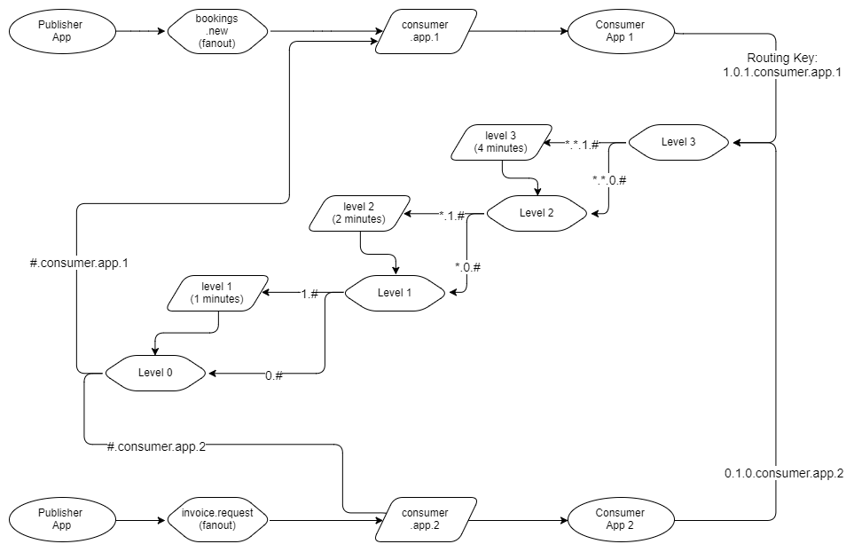
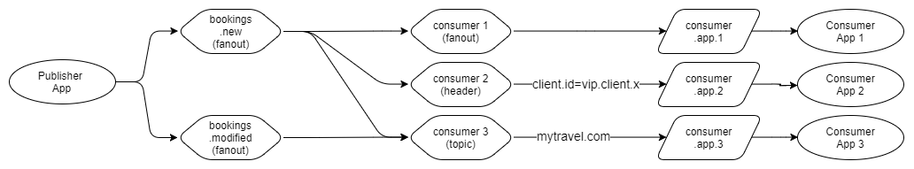

# RabbitMQ Patterns, Clustering, and Monitoring

This repository implements two RabbitMQ messaging patterns, RabbitMQ clustering with high availability (HA) using a gateway, and monitoring with Prometheus and Grafana.

## Features

1. **Messaging Patterns**:
    - Delayed Retry with Cascading Exchanges
    - Public/Private Message Exchange
2. **RabbitMQ Clustering and HA**:
    - Clustered RabbitMQ nodes for scalability and fault tolerance.
    - High Availability (HA) using queues mirrored across nodes.
    - Gateway for load balancing and seamless access to the cluster.
3. **Monitoring**:
    - Prometheus for metrics collection.
    - Grafana for visualization.

## Patterns

- **Delayed Retry with Cascading Exchanges**: Implements message retries using cascading exchanges and TTL.
- 
- **Public/Private Message Exchange**: Separates public broadcasts from private targeted messages.
- 

## Clustering and HA

- RabbitMQ nodes are clustered to distribute load and provide fault tolerance.
- High Availability (HA) ensures message durability by mirroring queues across nodes.
- Gateway facilitates uniform access to the cluster and balances incoming requests.

## Monitoring

- Prometheus scrapes RabbitMQ metrics via the Prometheus plugin.
- Grafana visualizes metrics with preconfigured dashboards.

## Installation

1. Clone the repository.
2. Run `docker-compose up` to start the RabbitMQ cluster, Prometheus, and Grafana.
3. Access:
    - RabbitMQ Management UI: `http://localhost:15672`
    - Grafana: `http://localhost:3000`

## Usage

- Configure RabbitMQ exchanges, queues, and HA policies.
- Use the provided Grafana dashboard JSON to monitor cluster performance.

## License

This project is licensed under the MIT License.
